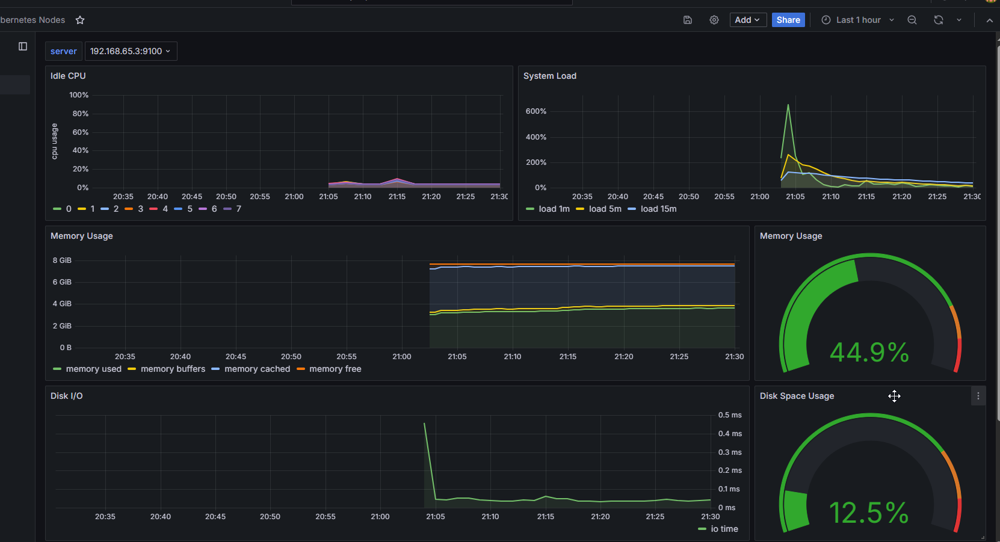
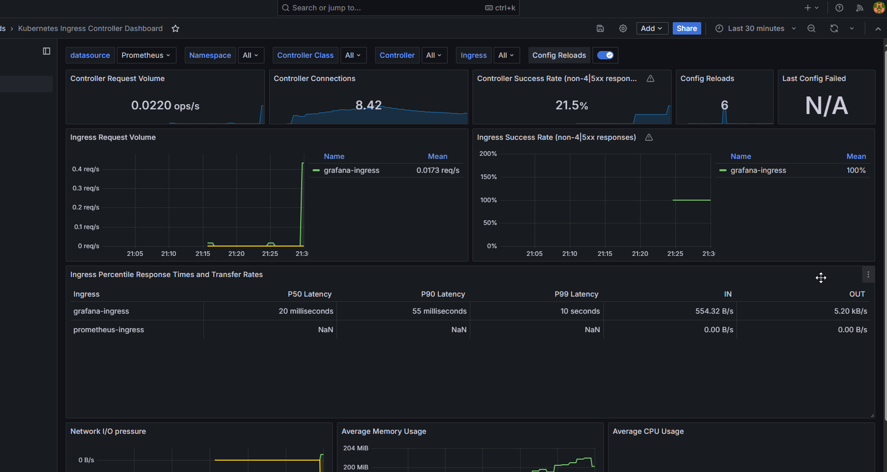
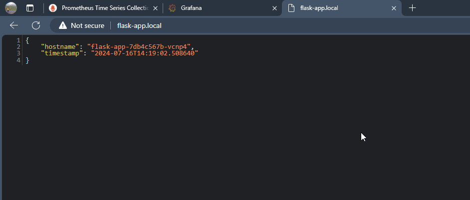

# Kubernetes Application Deployment

This repository contains the necessary files to deploy a simple web service on Kubernetes, along with monitoring and metrics Grafana dashboards embedded in a Helm chart setup using Prometheus and Grafana.






## Repository Layout

```plaintext
.
├── app-src
│   ├── app.py
│   └── requirment_modules.txt
├── Dockerfile
├── pic
│   ├── application-output.png
│   ├── Gerafana-Kubernetes-Node-dashboard.png
│   └── Grafana-Nginx-ingress-dashboard.png
├── ReadMe.md
└── terraform_and_configs
    ├── dashboards
    │   ├── k8s-cluster-dashboard.json
    │   └── nginx-ingress-dashboard.json
    ├── helm-value-files
    │   ├── grafana-values.yaml
    │   ├── metrics-server-values.yaml
    │   ├── nginx-ingress-values.yaml
    │   └── prometheus-values.yaml
    ├── k8s-manifest
    │   ├── app-deployment.yaml
    │   ├── app-ingress.yaml
    │   ├── app-service.yaml
    │   ├── grafana-ingress.yaml
    │   └── prometheus-ingress.yaml
    ├── main.tf
    ├── outputs.tf
    ├── providers.tf
    └── variables.tf
```

## Prerequisites

- Docker
- Kubernetes (Minikube, Docker Desktop, etc.)
- kubectl
- Terraform
- Helm

## Steps to Deploy

### 1. Apply the Terraform Files

Navigate to the `terraform_and_configs` directory and apply the Terraform configuration to build the Docker image, install NGINX Ingress, Metrics Server, Prometheus, and Grafana, and apply the Kubernetes manifests.

```sh
cd terraform_and_configs
terraform init
terraform apply
```


### 2. Accessing the Application and Services

- **Application**: Add an entry to your `/etc/hosts` file to access the service via the Ingress.

  ```plaintext
  127.0.0.1  flask-app.local
  127.0.0.1  prometheus.local
  127.0.0.1  grafana.local
  ```
or run the following command on your bash.
 ```sh
 echo -e "127.0.0.1  flask-app.local\n127.0.0.1  prometheus.local\n127.0.0.1  grafana.local" | sudo tee -a /etc/hosts
 ```
 
  Access the application via the browser or curl:

  ```sh
  curl http://flask-app.local
  ```

- **Grafana**: Access Grafana via the Ingress URL `grafana.local` . The default login credentials are `admin/admin123`.

- **Prometheus**: Access Prometheus via the Ingress `prometheus.local`.

## Conclusion

This project demonstrates how to build, package, and deploy a simple web service using Docker and Kubernetes. It also includes setting up monitoring and metrics using Prometheus and Grafana. Follow the instructions above to replicate the setup and explore the project further.
